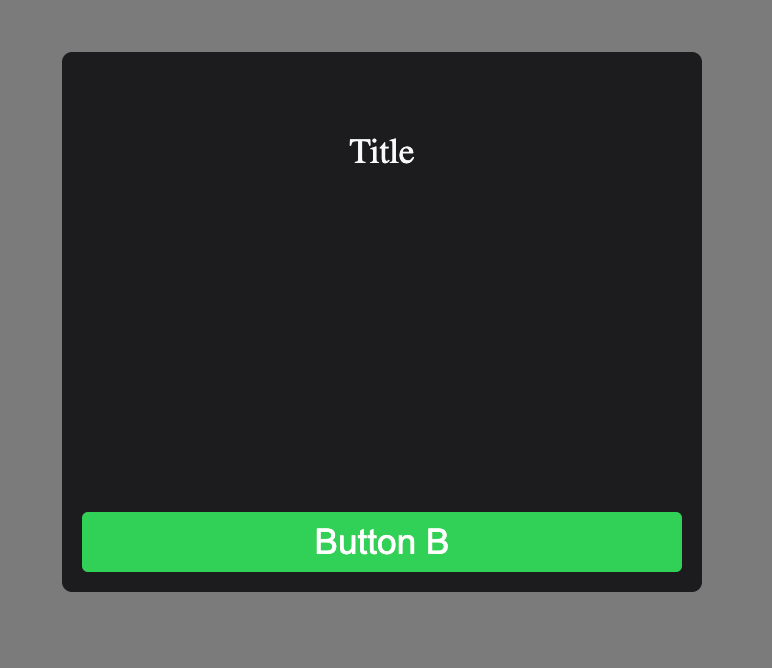
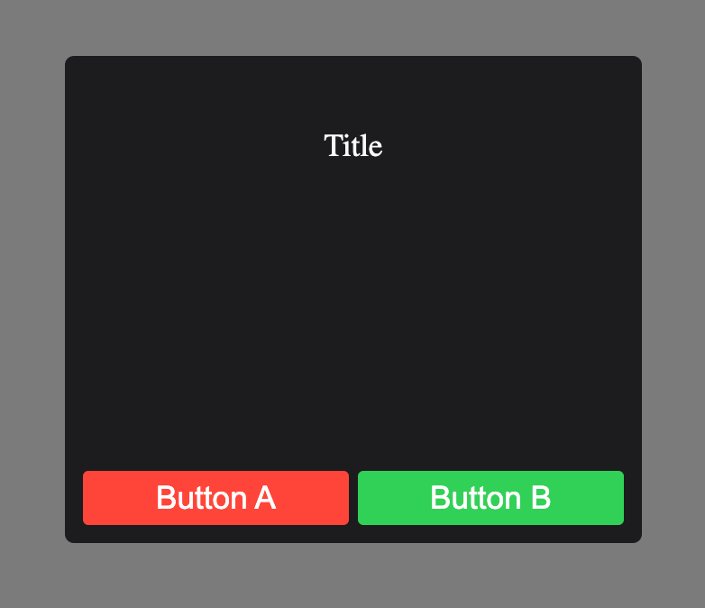
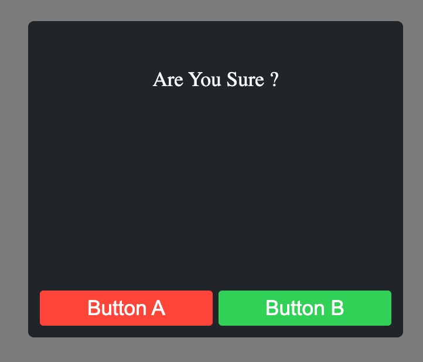
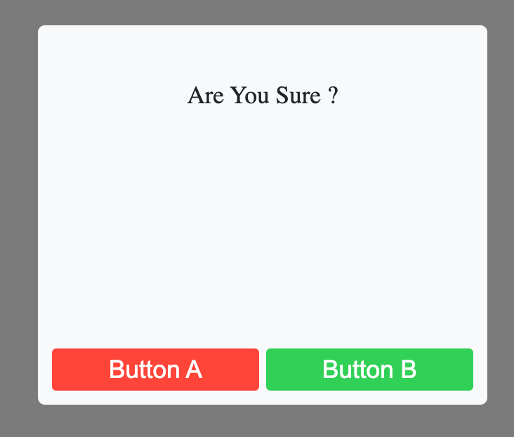
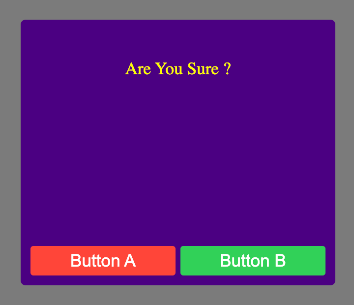
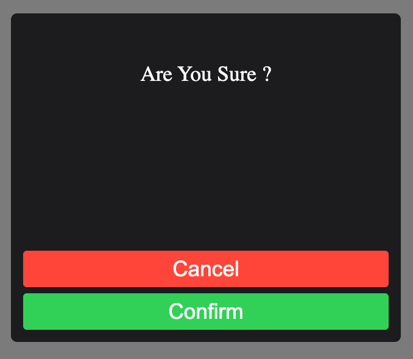

# Alertz

- Customize Alert & 2 Options

#### Preview


### Setup

```sh
npm install alertz
```

or

```sh
yarn add alertz
```

## Usage

<hr>

### Alert

<hr>

- type="alert" (default)



```jsx
import { useState } from 'react';
import { Alertz } from './components';

function App() {
  const [open, setOpen] = useState(false);

  const handleClick = () => {
    setOpen(!open);
  };
  return (
    <div>
      <button onClick={handleClick}>Click</button>
      <Alertz show={open} buttonB={{ onClick: handleClick }} />
    </div>
  );
}

export default App;
```

### 2 Options

<hr>

- type="confirm"



```jsx
import { useState } from 'react';
import { Alertz } from './components';

function App() {
  const [open, setOpen] = useState(false);

  const handleClick = () => {
    setOpen(!open);
  };
  return (
    <div>
      <button onClick={handleClick}>Click</button>
      <Alertz type="confirm" show={open} buttonB={{ onClick: handleClick }} />
    </div>
  );
}

export default App;
```

### Customize

<hr>

- Dark (Default) & Light Mode

```jsx
<Alertz type="confirm" mode="light" title="Are You Sure ?" show={open} />
```

| mode="dark"                                 |                 mode="light"                 |
| :------------------------------------------ | :------------------------------------------: |
|  |  |

<hr>

- titleColor & bgColor



```jsx
<Alertz
  bgColor="indigo"
  titleColor="yellow"
  type="confirm"
  title="Are You Sure ?"
  show={open}
/>
```

<hr>

- buttonsDirection="column" (default row)



```jsx
<Alertz
  type="confirm"
  buttonsDirection="column"
  title="Are You Sure ?"
  show={open}
  buttonB={{ title: 'Confirm' }}
  buttonA={{ title: 'Cancel' }}
/>
```

<hr>
